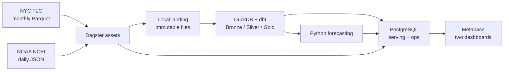

# Техническое задание: прогноз спроса на NYC Yellow Taxi

## 1. Цель

Разработать локальную прогнозно-аналитическую систему, которая регулярно загружает открытые данные о поездках NYC Yellow Taxi и погоде, контролирует их качество, строит витрины и прогнозирует число поездок на следующий доступный день.

Система предназначена для аналитика транспортной компании. Результат проекта — воспроизводимый прототип для MacBook Pro M3 Pro, 32 GB RAM. Срок реализации — 13–14 недель по 5 часов.

TLC публикует поездки примерно с двухмесячной задержкой, поэтому прогноз строится на день после последней доступной даты набора, а не на реальное завтра. Дата актуальности показывается на дашборде.

## 2. Минимальный стек

| Компонент | Назначение |
|---|---|
| PostgreSQL | Журнал запусков, манифесты источников, результаты DQ, агрегированные витрины и прогнозы для BI |
| Dagster | Расписание, зависимости шагов, retries, обработка сбоев и наблюдаемость assets |
| DuckDB | Локальная обработка Parquet/JSON и аналитические расчёты |
| dbt-duckdb | Слои Bronze/Silver/Gold, тесты, документация и lineage SQL-моделей |
| Metabase | Предметный и операционный дашборды из PostgreSQL |
| Python | Клиенты источников и модели SARIMAX/HistGradientBoosting |

### Исключённые компоненты

- **Airflow** не нужен, поскольку оркестрацию выполняет Dagster.
- **Spark** избыточен для 2,01 GiB сжатых исходных данных и одной машины.
- **Trino** не нужен: распределённый SQL-слой дублирует DuckDB.
- **ClickHouse** не нужен: агрегированные витрины помещаются в PostgreSQL.
- **Iceberg** не нужен: историзация обеспечивается неизменяемыми исходными файлами, source manifest и версионируемыми пересборками разделов.

Добавление исключённых компонентов не входит в обязательную часть проекта.

## 3. Архитектура



PostgreSQL используется повторно для Dagster storage и данных приложения, но в отдельных базах или схемах. В него загружаются только небольшие агрегаты, результаты проверок и прогнозы; детальные поездки остаются в Parquet/DuckDB.

## 4. Источники

### NYC TLC Yellow Taxi

- ежемесячные Parquet-файлы по HTTPS;
- основной период: январь 2023 — декабрь 2025, 36 файлов, 2,01 GiB на дату проверки;
- поля поездки не содержат прямых идентификаторов пассажира или водителя;
- обновление — ежемесячное;
- источник: [TLC Trip Record Data](https://www.nyc.gov/site/tlc/about/tlc-trip-record-data.page).

### NOAA NCEI Daily Summaries

- ежедневный JSON API по HTTPS;
- станция `USW00094728`, Central Park;
- поля: дата, минимальная/максимальная температура, осадки, снег и ветер;
- обновление — ежедневное;
- персональные данные отсутствуют;
- источник: [NCEI Access Data Service API](https://www.ncei.noaa.gov/support/access-data-service-api-user-documentation).

Источники разнородны по способу публикации, формату и частоте обновления. На 16 сентября 2026 года оба источника были доступны; NOAA вернул 1096 наблюдений за 2023–2025 годы.

## 5. Слои данных

### Landing

Исходные Parquet и JSON сохраняются без изменения. Для каждого объекта в PostgreSQL записываются URL, ETag/Last-Modified, SHA-256, размер, дата загрузки и `run_id`.

### Bronze, DuckDB/dbt

- `bronze_yellow_taxi_trips` — внешнее представление над файлами TLC с техническими полями;
- `bronze_weather_daily` — типизированные наблюдения NOAA;
- `bronze_taxi_zones` — справочник зон;
- `quarantine_records` — недопустимые строки и причина отклонения.

### Silver, DuckDB/dbt

- `silver_taxi_trips` — очищенные поездки;
- `silver_weather_daily` — очищенная погода;
- `silver_daily_features` — суточный спрос, календарные признаки, лаги и скользящие статистики.

### Gold, DuckDB -> PostgreSQL

- `daily_demand` — суточный факт и погодные признаки;
- `zone_activity` — агрегаты по зонам;
- `model_metrics` — результаты backtesting;
- `daily_forecast` — прогноз и последующая фактическая ошибка.

Dagster атомарно копирует Gold в staging-схему PostgreSQL, проверяет количество строк и заменяет целевые таблицы в транзакции.

## 6. Инкрементальность, идемпотентность и сбои

### TLC

- загружаются только месяцы, отсутствующие в source manifest;
- повторный запуск пропускает файл с той же версией и checksum;
- при изменении опубликованного файла пересобирается только соответствующий месяц;
- watermark меняется после успешной проверки и публикации витрин.

### NOAA

- повторно запрашиваются последние 14 дней;
- данные обновляются по ключу `(station_id, observation_date)`;
- уточнения заменяют старое значение, дубликаты не создаются.

### Сбои

- HTTP timeout и до трёх retries с exponential backoff для `429`, `5xx` и сетевых ошибок;
- неполный или повреждённый файл не публикуется в Landing;
- `404` будущего месяца отмечается как `not_available`;
- неуспешный run получает статус `failed`, сохраняет ошибку и не продвигает watermark;
- временные файлы и staging-таблицы не считаются опубликованными данными;
- повторный запуск продолжает работу от последнего успешного состояния.

Журнал содержит `run_id`, параметры, начало/окончание, статус, watermarks, число прочитанных/записанных/отклонённых строк, длительности шагов и ошибку.

## 7. Контроль качества

Результат каждой проверки сохраняется в PostgreSQL и показывается в Metabase.

| Тип | Обязательная проверка |
|---|---|
| Полнота | ключевые даты и зоны не `NULL` |
| Уникальность | уникальны дата погоды, дата Gold и версия source-файла |
| Типы | схема соответствует YAML-контракту |
| Допустимость | категориальные коды входят в справочник |
| Диапазоны | длительность, расстояние и погода физически правдоподобны |
| Ссылочная целостность | зоны поездки существуют в справочнике |
| Актуальность | TLC не старше 90 дней, NOAA не старше 3 дней |
| Объём | файл не пуст и объём месяца не является критической аномалией |

Некорректные строки помещаются в quarantine. Если их доля превышает 1%, публикация Silver/Gold блокируется.

## 8. Прогнозирование

Целевой показатель `daily_yellow_taxi_trips` — число посадок Yellow Taxi за календарный день в часовом поясе `America/New_York`.

- Гранулярность: один день, весь Нью-Йорк.
- Горизонт: один следующий день после последней доступной даты TLC.
- Модель 1: SARIMAX с недельной сезонностью.
- Модель 2: HistGradientBoostingRegressor с календарными признаками, лагами спроса `1, 7, 14, 28`, rolling mean/std `7` и `28` дней и лагированной погодой.
- Baseline: значение спроса `t-7`.

Backtesting выполняется expanding window: минимум 365 дней обучения и последовательный one-step-ahead прогноз на последних 180 днях. Случайное разбиение запрещено. Все признаки для даты `t` формируются только из данных `< t`.

Метрики: MAE, RMSE, sMAPE и WAPE. Основная метрика выбора — WAPE. Если модели отличаются менее чем на 1 п.п., выбирается более простая. Метрики, интервалы выборки, параметры, seed и время работы сохраняются.

## 9. Дашборды Metabase

### «Спрос и прогноз»

- дата актуальности и последний фактический спрос;
- прогноз на следующий доступный день;
- временной график факта, прогноза и скользящей нормы;
- сравнение ошибок двух моделей и baseline;
- активность по зонам и дням недели;
- связь спроса с погодой.

### «Состояние платформы»

- статус и длительность последнего Dagster run;
- watermarks двух источников;
- прочитанные, записанные и отклонённые строки;
- результаты DQ и quarantine;
- ошибки и число retries;
- версия данных и модели.

## 10. Воспроизводимый Big Data-эксперимент

Профили данных:

- `sample` — три месяца для разработки и интеграционных тестов;
- `full` — 36 месяцев 2023–2025, 2,01 GiB сжатого Parquet;
- период задаётся параметрами `START_MONTH` и `END_MONTH`.

Обязательный эксперимент сравнивает в DuckDB два представления одних данных:

1. исходный набор из 36 Parquet-файлов;
2. Parquet dataset, разбитый по `year/month`.

Для запроса за один месяц и запроса за весь период выполняются один прогревочный и пять измеряемых запусков. Сохраняются elapsed time, CPU time, peak RSS, прочитанные строки/файлы и объём данных. В отчёт включаются медиана, p95 и объяснение плана `EXPLAIN ANALYZE`. Эффект partition pruning считается доказанным только при уменьшении числа прочитанных файлов или строк для месячного запроса.

Source manifest фиксирует URL, версии, checksum, размеры, число строк, версии DuckDB/dbt и git commit. Поэтому масштаб и результаты можно воспроизвести.

## 11. Автоматизация

```bash
make bootstrap                 # зависимости и инициализация
make up                        # PostgreSQL, Dagster и Metabase
make materialize PROFILE=sample
make backtest
make benchmark PROFILE=full
make test
make down                      # остановка без удаления данных
```

Dagster job содержит assets: `source_manifest -> landing -> bronze -> silver -> gold -> forecast -> postgres_publish`. Тот же job запускается вручную и по расписанию.

## 12. Критерии приёмки

- Два открытых разнородных источника загружаются автоматически и без персональных данных.
- Повторный запуск не создаёт дубликаты и не меняет результат при неизменных источниках.
- Новый/исправленный период обрабатывается без полной перезагрузки истории.
- Сбой не продвигает watermark; повторный запуск успешно восстанавливается.
- Журнал запусков и все типы DQ доступны в PostgreSQL и Metabase.
- dbt строит Bronze/Silver/Gold и генерирует документацию lineage.
- Обе модели и baseline оценены на одинаковых временных folds.
- В Metabase доступны два целевых дашборда.
- `sample` и `full` воспроизводимы из конфигурации и manifest.
- Big Data-эксперимент создаёт CSV с измерениями и воспроизводимый вывод.
- Проект запускается по README на Apple Silicon без `amd64`-эмуляции.

## 13. План на 14 недель

| Недели | Результат |
|---|---|
| 1–2 | ARM64 smoke test, Docker Compose, PostgreSQL, Dagster, DuckDB и Metabase |
| 3–4 | Клиенты TLC/NOAA, Landing, manifest и журнал |
| 5–6 | dbt Bronze/Silver, инкрементальность и обработка сбоев |
| 7 | Gold и полный набор DQ-проверок |
| 8–9 | Признаки, две модели и baseline |
| 10 | Backtesting и сохранение метрик |
| 11 | Два дашборда Metabase |
| 12 | Big Data-эксперимент |
| 13 | Интеграционные и failure-тесты, lineage и README |
| 14 | Отчёт, презентация, демонстрация и резерв |

## 14. Совместимость

DuckDB официально поддерживает [macOS и Linux ARM64](https://duckdb.org/install/), PostgreSQL публикует официальный [`arm64v8`-образ](https://hub.docker.com/_/postgres), а Metabase — официальный [`linux/arm64`-образ](https://hub.docker.com/r/metabase/metabase/tags/). Dagster, dbt и модели запускаются в зафиксированном ARM64 Python-контейнере. Все версии и image digests фиксируются; тег `latest` запрещён.

Рекомендуемый лимит Docker Desktop — 10–12 GB RAM. Полный benchmark запускается отдельно от Metabase и обучения моделей.
