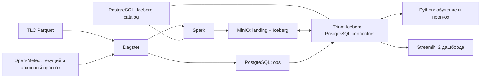

# Техническое задание: локальная прогнозно-аналитическая lakehouse-платформа

## 1. Назначение

Разработать локальную систему, которая регулярно загружает открытые данные о поездках NYC Yellow Taxi и погоде, хранит их в Apache Iceberg, прогнозирует почасовой спрос на такси и показывает предметные и операционные показатели.

Пользователь — аналитик таксомоторного парка. Решение: оценить нагрузку по районам на ближайшую неделю, спланировать смены и выбрать часы для технического обслуживания машин.

## 2. Бизнес-задача и прогнозируемый показатель

Система ежедневно прогнозирует рыночный спрос на Yellow Taxi на следующие семь суток от текущего момента.

- Основной показатель `trip_count_hour`: число валидных поездок, начавшихся в borough `b` в течение часа `t`.
- Территории: Manhattan, Brooklyn, Queens, Bronx и Staten Island; городской итог равен сумме boroughs.
- Горизонт: следующие 168 часов.
- Частота расчёта: ежедневно в 06:00 `America/New_York`; горизонт начинается со следующего полного часа. Модель переобучается после появления нового месяца TLC.
- Временная зона: `America/New_York`, с явной обработкой DST.
- История обучения: все доступные полные месяцы начиная с января 2022 года; диапазон задаётся конфигурацией.
- Погода загружается для фиксированных координат boroughs из конфигурации: Manhattan `(40.7831, -73.9712)`, Brooklyn `(40.6782, -73.9442)`, Queens `(40.7282, -73.7949)`, Bronx `(40.8448, -73.8648)`, Staten Island `(40.5795, -74.1502)`.

TLC публикует поездки с задержкой, поэтому недоступные лаги за вчера и прошлую неделю не используются. Прогноз текущей недели строится по многолетней сезонности, календарю, долгосрочному тренду, сопоставимым периодам прошлых лет и актуальному прогнозу погоды.

### Результат прогнозирования

Для каждого borough и каждого из 168 часов сохраняются:

- `forecast_generated_at` и `demand_data_cutoff`;
- `borough`, `target_hour` и горизонт от 1 до 168 часов;
- `model_name`, `model_version` и версия обучающих данных;
- `forecast_trip_count` — ожидаемое число поездок;
- `lower_80` и `upper_80` — эмпирический 80-процентный интервал;
- `seasonal_norm` — медианный спрос для сопоставимых часов прошлых лет;
- `demand_index` — отношение прогноза к сезонной норме;
- `delta_to_norm` и `delta_to_norm_pct`;
- `is_peak` — прогноз выше 90-го перцентиля сопоставимых часов.

Из почасовых значений рассчитываются прогноз поездок за семь дней, пиковый час, максимальная нагрузка, количество пиковых часов и средняя ширина интервала. После публикации фактических поездок прогноз связывается с фактом для оценки ошибки.

### Ценность для аналитика

Дашборд отвечает на вопросы:

1. В каком borough и в какие часы ожидается наибольший спрос?
2. Насколько нагрузка отличается от обычной для этого сезона и часа недели?
3. Где следует обеспечить повышенную доступность машин и когда удобнее проводить обслуживание?
4. Насколько надёжен прогноз и как точность меняется с горизонтом?

Система прогнозирует рыночный спрос, но не рассчитывает точное число машин, маршруты, цены или назначения водителям: для этого нужны внутренние данные конкретного парка.

## 3. Источники

| Источник | Получение и формат | Периодичность | Используемые данные |
|---|---|---|---|
| [NYC TLC Trip Record Data](https://www.nyc.gov/site/tlc/about/tlc-trip-record-data.page) | месячные файлы Parquet по HTTPS | ежемесячно, обычно с задержкой около двух месяцев | время начала и окончания, зоны, расстояние, стоимость, тип оплаты |
| [Open-Meteo Forecast API](https://open-meteo.com/en/docs), [Historical Forecast](https://open-meteo.com/en/docs/historical-forecast-api) и [Previous Runs](https://open-meteo.com/en/docs/previous-runs-api) | REST API, JSON | прогноз обновляется несколько раз в сутки | доступные на момент расчёта температура, осадки и ветер; прогнозы с горизонтом 1–7 дней для backtesting |

Источники разнородны по способу получения и формату. В загрузку попадает только белый список полей без персональных данных. Справочник зон TLC используется для преобразования `PULocationID` в borough и отдельным источником не считается. На 16.09.2026 контрольный Parquet TLC, актуальный и архивный запросы Open-Meteo отвечали HTTP 200.

## 4. Границы проекта

В составе решения:

- Spark — чтение, очистка, агрегации и запись Iceberg;
- Iceberg + MinIO — таблицы, снимки и объектное хранение;
- PostgreSQL — JDBC-каталог Iceberg и независимый журнал запусков;
- Trino — единая SQL-точка доступа;
- Dagster — расписание, зависимости, повторы и наблюдаемость конвейера;
- Python/scikit-learn — обучение и backtesting;
- Streamlit — два интерактивных дашборда.

`dbt`, Airflow, ClickHouse, DuckDB и Metabase не используются: их функции в заданном масштабе уже покрыты выбранными компонентами.

## 5. Архитектура и слои

Spark и Trino используют один JDBC-каталог Iceberg и один warehouse `s3://lakehouse/warehouse`. Python-модуль читает признаки и записывает `demand_forecasts` через Trino; прямой записи Iceberg-файлов или метаданных в MinIO из Python нет. Streamlit обращается только к Trino, включая операционные таблицы через PostgreSQL connector.

Слои хранения:

1. `landing` — исходные Parquet/JSON, дата получения, URL, ETag/Last-Modified и SHA-256.
2. `bronze` — типизированные Iceberg-таблицы без бизнес-агрегаций; добавлены `source_file`, `source_period`, `ingested_at`, `run_id`.
3. `silver` — очищенные поездки с borough, прогнозы погоды по часу и карантин отклонённых строк.
4. `gold` — `demand_borough_hourly`, признаки, `demand_forecasts`, `backtest_predictions` и метрики.

Для одного показателя должна быть показана цепочка: TLC/Open-Meteo → запуск Dagster → Spark-преобразование → Iceberg-таблица → gold-витрина → показатель → предметный дашборд. Iceberg snapshots используются для демонстрации истории изменений.

## 6. Загрузка и устойчивость

- TLC проверяется по месячным разделам. Новый месяц загружается только при отсутствии успешно обработанной версии с тем же checksum.
- Актуальный прогноз Open-Meteo загружается ежедневно и сохраняется вместе с временем его выпуска; архив прогнозов загружается только для заданных backtesting-периодов.
- Идемпотентные ключи погоды: источник, `forecast_issued_at`, координата и `target_hour`.
- Логический ключ прогноза: `(scheduled_at, model_version, borough, target_hour)`. `run_id` используется только для аудита; повтор запуска выполняет `MERGE`, а не добавляет новую версию тех же данных.
- Партиции: поездки — `months(pickup_at)`, погода — `days(forecast_issued_at)`, спрос и прогнозы — `days(target_hour)`.
- Повторный запуск с неизменными источниками не меняет бизнес-таблицы и не создаёт новый Iceberg snapshot.
- При изменении исходного файла соответствующий месяц атомарно заменяется, а не добавляется повторно.
- Файл сначала записывается во временный объект, проверяется по размеру/checksum и только затем публикуется.
- Для timeout, HTTP 429 и 5xx выполняются три повтора с экспоненциальной задержкой. Ошибка одной партиции не публикует неполный downstream-слой.
- После сбоя запуск продолжается с первой незавершённой партиции. Iceberg commit обеспечивает атомарность записи.

Журнал `ops.pipeline_runs` и `ops.asset_runs` хранит `run_id`, расписание/ручной запуск, границы периода, checksum, статус, число прочитанных/записанных/отклонённых строк, время начала и конца, длительность, номер попытки и текст ошибки.

## 7. Качество данных

Результат каждой проверки записывается в `ops.quality_results` с `run_id`, таблицей, правилом, фактическим значением, порогом и статусом.

Обязательные проверки:

- полнота: `pickup_at`, `dropoff_at`, `PULocationID` не пусты;
- уникальность: одна фактическая строка на `(borough, hour)` и одна прогнозная строка на `(scheduled_at, model_version, borough, target_hour)`;
- типы и схема: вход соответствует ожидаемому контракту;
- допустимость и диапазоны: `dropoff_at > pickup_at`, длительность до 6 часов, расстояние 0–200 миль, стоимость неотрицательна;
- ссылочная целостность: зоны присутствуют в справочнике TLC;
- актуальность: последний доступный месяц TLC не старше 90 дней, выпуск прогноза погоды — не старше 12 часов;
- согласованность прогноза: значения неотрицательны и `lower_80 <= forecast_trip_count <= upper_80`.

Строки с ошибками диапазона или ссылочной целостности помещаются в `silver.quarantine_trips`. Публикация останавливается при изменении схемы, отсутствии обязательного поля, нарушении уникальности gold или доле карантина более 1%. Меньшая доля формирует предупреждение.

## 8. Прогнозирование

Реализовать две модели:

1. `SeasonalNaive`: медиана спроса для того же borough, часа недели и сезона по предыдущим годам.
2. `HistGradientBoostingRegressor`: borough, час, день недели, месяц, выходной/праздник, сезонная норма, сопоставимый период прошлого года, долгосрочный тренд и прогноз температуры, осадков и ветра.

Будущие фактические погодные значения не используются. Для каждого запуска сохраняются параметры, период обучения, признаки, версия модели, версия данных и время выпуска погодного прогноза. Городской итог рассчитывается суммой boroughs.

Backtesting выполняется методом rolling origin минимум на 12 еженедельных точках. Для каждой точки:

1. Из спроса доступны только месяцы, завершившиеся до `forecast_origin - publication_lag_days`. Параметр равен 60 дням в основном прогоне; отдельно выполняется проверка чувствительности при 90 днях. Это явное допущение для исторических дат, для которых точное время публикации файла неизвестно.
2. Погодные признаки берутся из Open-Meteo Previous Runs, а не из будущего факта. Для горизонта `h` часов используется версия `previous_dayN`, где `N = ceil(h / 24)` и `N` находится от 1 до 7.
3. Обе модели прогнозируют следующие 168 часов для пяти boroughs.
4. Прогноз сравнивается с опубликованным позднее фактом.

Основная метрика — WAPE; дополнительные — MAE, RMSE, sMAPE и recall пиковых часов. Ошибки показываются по borough и группам горизонта 1–24, 25–72 и 73–168 часов. Итоговая модель выбирается по медиане WAPE.

Границы `lower_80` и `upper_80` рассчитываются как 10-й и 90-й перцентили остатков backtesting отдельно для каждого borough и трёх групп горизонта. Фактический и прогнозный пик определяются одинаково: значение выше 90-го перцентиля исторического спроса для того же borough, часа недели и календарного сезона. Сезон — квартал; сопоставимая выборка содержит одинаковые часы недели за тот же квартал предыдущих лет.

Бизнес-гипотеза считается подтверждённой, если выбранная модель снижает WAPE относительно `SeasonalNaive` не менее чем на 5% и находит не менее 70% фактических пиковых часов. Если пороги не достигнуты, система остаётся завершённым прототипом, но бизнес-эффект прогноза признаётся недоказанным.

## 9. Дашборды

### Предметный

Отвечает на вопросы пользователя:

- как менялся почасовой спрос за выбранный период;
- какой спрос ожидается по boroughs в следующие семь дней;
- где и когда ожидается пик и насколько он выше сезонной нормы;
- какова неопределённость каждого почасового прогноза;
- насколько ошибались модели в backtesting в целом и на разных горизонтах;
- как спрос связан с температурой и осадками.

Верхняя строка содержит время расчёта, границу доступных данных, прогноз поездок за семь дней, пиковый borough/час и число пиковых часов. Основной график показывает сезонную норму, точечный прогноз и 80-процентный интервал на 168 часов. Таблица пиков содержит borough, час, прогноз, интервал и индекс спроса.

Блок качества показывает WAPE, MAE, RMSE, sMAPE, recall пиков и сравнение с `SeasonalNaive` по borough и группам горизонта. После поступления факта график дополняется фактическими значениями и почасовой ошибкой.

Фильтры: borough, модель, прогнозный запуск, период backtesting, будний/выходной день и погодное условие.

### Операционный

Показывает свежесть TLC и погодного прогноза, дату последнего обучения модели, последние запуски, длительность, объёмы строк, повторные попытки, ошибки, проверки качества и число строк в карантине.

## 10. Воспроизводимый Big Data-эксперимент

Фиксированный диапазон — Yellow Taxi с января 2023 по декабрь 2024 года. Профили задаются конфигурацией:

- `S`: 2023-01—2023-03, 3 файла;
- `M`: 2023-01—2023-12, 12 файлов;
- `L`: 2023-01—2024-12, 24 файла.

Файл `benchmark-manifest.lock` фиксирует URL, SHA-256, байты и число строк каждого файла. Исходные объекты сохраняются в неизменяемом префиксе `landing/benchmark/<sha256>/`. Чистый запуск прекращается при несовпадении checksum; принять исправленную upstream-версию можно только явным обновлением lock-файла с фиксацией новой версии эксперимента.

Эксперимент 1: Spark обрабатывает `S/M/L` с одинаковыми настройками. Измеряются wall time, строк/с, peak memory и shuffle read/write.

Эксперимент 2: один запрос Trino с фильтром по месяцу выполняется на эквивалентных временных таблицах без партиционирования и с Iceberg-партиционированием. Измеряются wall time, processed input rows/bytes и peak memory.

Каждый замер выполняется один раз для прогрева и три раза для расчёта медианы. В отчёте фиксируются версии ПО, параметры Spark/Trino и характеристики MacBook Pro M3 Pro, 32 GB. Временная непартиционированная таблица удаляется после фиксации результатов.

## 11. Развёртывание и совместимость

- Запуск на Docker Desktop for Mac с Apple Silicon через `docker compose`.
- Контейнеры фиксируются тегами и digest: `apache/spark:3.5.7`, `trinodb/trino:483`, `postgres:16-alpine`, `quay.io/minio/minio:RELEASE.2025-04-22T22-12-26Z`, базовый Python 3.12. Для Spark фиксируются `iceberg-spark-runtime-3.5_2.12:1.11.0` и `iceberg-aws-bundle:1.11.0`.
- На 16.09.2026 у перечисленных Spark, Trino, PostgreSQL и MinIO образов проверены Linux/ARM64-манифесты. Trino поддерживает ARM64 с версии 359; [Docker Desktop официально поддерживает Apple silicon](https://docs.docker.com/desktop/setup/install/mac-install/).
- Spark ограничивается 12 GB RAM, Trino — 4 GB, остальные сервисы суммарно — до 4 GB; не менее 12 GB остаётся macOS и Docker Desktop.
- JDBC-каталог использует `schema-version=V1`. Команда `make bootstrap` создаёт его служебные таблицы миграцией из зафиксированной версии Iceberg до запуска Spark и Trino; PostgreSQL-схемы и роли `iceberg_catalog` и `ops` разделены.
- Spark и Trino используют одинаковые MinIO endpoint, region, access key, secret key и warehouse. Включаются S3 path-style access и healthchecks MinIO/PostgreSQL перед bootstrap; междвижковый smoke test записывает таблицу Spark, читает её Trino, затем выполняет обратную запись через Trino и чтение Spark.
- Версии Python-зависимостей фиксируются lock-файлом. Параметры источников, диапазоны дат и лимиты памяти задаются в YAML и `.env.example`; секреты не коммитятся.
- Команды: `make up` — инфраструктура, `make bootstrap` — каталоги и служебные таблицы, `make run` — полный конвейер, `make test` — проверки, `make down` — остановка. README содержит подготовку и сценарий демонстрации.

## 12. План на 14 недель

| Неделя | Результат | Часы |
|---|---|---:|
| 1 | границы, показатель, архитектура, проверка источников | 4 |
| 2 | Compose, MinIO, PostgreSQL-каталог, Trino | 5 |
| 3 | инкрементальная загрузка TLC | 5 |
| 4 | актуальные и архивные прогнозы Open-Meteo | 4 |
| 5 | `landing/bronze`, идемпотентность | 6 |
| 6 | `silver`, карантин и проверки качества | 5 |
| 7 | спрос по boroughs, признаки и SQL-доступ | 5 |
| 8 | сезонный baseline и backtesting с задержкой TLC | 5 |
| 9 | градиентный бустинг, интервалы и бизнес-метрики | 5 |
| 10 | предметный дашборд | 5 |
| 11 | журнал, операционный дашборд, восстановление | 5 |
| 12 | Big Data-эксперименты | 5 |
| 13 | сквозная автоматизация и интеграционные тесты | 5 |
| 14 | README, отчёт, презентация и репетиция защиты | 5 |

Итого: 69 часов.

## 13. Критерии приёмки

- Система разворачивается по README и выполняет полный цикл командами из раздела 11 на MacBook Pro M3 Pro.
- Оба источника загружаются автоматически; новый запуск обрабатывает только новые или изменённые партиции.
- Два одинаковых запуска дают одинаковые бизнес-данные; тест исправленного месяца не создаёт дублей.
- Повтор одного `scheduled_at` не создаёт второй прогноз; `run_id` повторной попытки остаётся в журнале.
- Имитация timeout/HTTP 500 приводит к повторам, записи ошибки в журнал и успешному продолжению после восстановления.
- Все перечисленные проверки качества выполняются, результаты сохранены, некорректные строки доступны в карантине.
- В Iceberg существуют `bronze`, `silver`, `gold`, snapshots и воспроизводимая история хотя бы одной таблицы.
- Междвижковый smoke test подтверждает чтение и запись одной Iceberg-таблицы из Spark и Trino через общий JDBC-каталог.
- Ежедневно формируется прогноз на 168 часов по пяти boroughs и городской итог; переобучение запускается после нового месяца TLC.
- Обучены две модели; backtesting содержит не менее 12 срезов, имитирует 60-дневную задержку и использует только доступные тогда прогнозы погоды.
- Рассчитаны WAPE, MAE, RMSE, sMAPE, recall пиков и результат проверки бизнес-гипотезы.
- Для 80-процентного интервала рассчитано фактическое покрытие; пик и горизонты определены одинаково в обучении, backtesting и дашборде.
- Доступны предметный и операционный дашборды, каждый элемент отвечает заявленному вопросу.
- Для одного показателя показана полная прослеживаемость до источников.
- Профили `S/M/L` воспроизводятся из манифеста; результаты двух Big Data-экспериментов сохранены в таблице и графиках.
