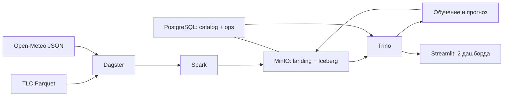

# Техническое задание: локальная прогнозно-аналитическая lakehouse-платформа

## 1. Назначение

Разработать локальную систему, которая регулярно загружает открытые данные о поездках NYC Yellow Taxi и погоде, хранит их в Apache Iceberg, прогнозирует почасовой спрос на такси и показывает предметные и операционные показатели.

Пользователь — аналитик транспортных операций. Решение: оценить нагрузку на следующие сутки после доступного среза данных и определить часы повышенного спроса.

## 2. Прогнозируемый показатель

- Показатель: число валидных поездок Yellow Taxi с началом в каждом часовом интервале по всему NYC.
- Временная зона: `America/New_York`, с явной обработкой переходов DST.
- Горизонт прогноза: 24 часа после последнего доступного часа TLC.
- Частота формирования: после каждой успешной месячной загрузки TLC; проверка появления новых данных выполняется еженедельно.
- История для обучения: последние 24 полных месяца либо фиксированный учебный диапазон.

Из-за задержки публикации TLC результат не является прогнозом от текущего календарного момента. Это ограничение показывается в интерфейсе; прототип предназначен для проверки метода и сценарного планирования, а не для оперативной диспетчеризации.

## 3. Источники

| Источник | Получение и формат | Периодичность | Используемые данные |
|---|---|---|---|
| [NYC TLC Trip Record Data](https://www.nyc.gov/site/tlc/about/tlc-trip-record-data.page) | месячные файлы Parquet по HTTPS | ежемесячно, обычно с задержкой около двух месяцев | время начала и окончания, зоны, расстояние, стоимость, тип оплаты |
| [Open-Meteo Historical Weather API](https://open-meteo.com/en/docs/historical-weather-api) | REST API, JSON | ERA5 обновляется ежедневно с задержкой около пяти дней | температура, осадки, скорость ветра для координат NYC |

Источники разнородны по способу получения и формату. В загрузку попадает только белый список полей без персональных данных. На 16.09.2026 контрольный Parquet TLC за январь 2025 года и тестовый запрос Open-Meteo отвечали HTTP 200.

## 4. Границы проекта

В составе решения:

- Spark — чтение, очистка, агрегации и запись Iceberg;
- Iceberg + MinIO — таблицы, снимки и объектное хранение;
- PostgreSQL — JDBC-каталог Iceberg и независимый журнал запусков;
- Trino — единая SQL-точка доступа;
- Dagster — расписание, зависимости, повторы и наблюдаемость конвейера;
- Python/scikit-learn — обучение и backtesting;
- Streamlit — два интерактивных дашборда.

`dbt`, Airflow, ClickHouse, DuckDB и Metabase не используются: их функции в заданном масштабе уже покрыты выбранными компонентами.

## 5. Архитектура и слои

Слои хранения:

1. `landing` — исходные Parquet/JSON, дата получения, URL, ETag/Last-Modified и SHA-256.
2. `bronze` — типизированные Iceberg-таблицы без бизнес-агрегаций; добавлены `source_file`, `source_period`, `ingested_at`, `run_id`.
3. `silver` — очищенные поездки, погода по часу и карантин отклонённых строк.
4. `gold` — почасовой спрос, признаки моделей, прогнозы, фактические значения и метрики backtesting.

Для одного показателя должна быть показана цепочка: TLC/Open-Meteo → запуск Dagster → Spark-преобразование → Iceberg-таблица → gold-витрина → показатель → предметный дашборд. Iceberg snapshots используются для демонстрации истории изменений.

## 6. Загрузка и устойчивость

- TLC проверяется по месячным разделам. Новый месяц загружается только при отсутствии успешно обработанной версии с тем же checksum.
- Open-Meteo загружается дневными интервалами после максимальной успешно обработанной даты.
- Партиции: поездки — `months(pickup_at)`, погода и агрегаты — `days(event_at)`.
- Повторный запуск с неизменными источниками не меняет бизнес-таблицы и не создаёт новый Iceberg snapshot.
- При изменении исходного файла соответствующий месяц атомарно заменяется, а не добавляется повторно.
- Файл сначала записывается во временный объект, проверяется по размеру/checksum и только затем публикуется.
- Для timeout, HTTP 429 и 5xx выполняются три повтора с экспоненциальной задержкой. Ошибка одной партиции не публикует неполный downstream-слой.
- После сбоя запуск продолжается с первой незавершённой партиции. Iceberg commit обеспечивает атомарность записи.

Журнал `ops.pipeline_runs` и `ops.asset_runs` хранит `run_id`, расписание/ручной запуск, границы периода, checksum, статус, число прочитанных/записанных/отклонённых строк, время начала и конца, длительность, номер попытки и текст ошибки.

## 7. Качество данных

Результат каждой проверки записывается в `ops.quality_results` с `run_id`, таблицей, правилом, фактическим значением, порогом и статусом.

Обязательные проверки:

- полнота: `pickup_at`, `dropoff_at`, `PULocationID` не пусты;
- уникальность: в почасовой gold-витрине одна строка на час;
- типы и схема: вход соответствует ожидаемому контракту;
- допустимость и диапазоны: `dropoff_at > pickup_at`, длительность до 6 часов, расстояние 0–200 миль, стоимость неотрицательна;
- ссылочная целостность: зоны присутствуют в справочнике TLC;
- актуальность: последний доступный месяц TLC не старше 90 дней, погода — не старше 7 дней относительно доступности источника.

Строки с ошибками диапазона или ссылочной целостности помещаются в `silver.quarantine_trips`. Публикация останавливается при изменении схемы, отсутствии обязательного поля, нарушении уникальности gold или доле карантина более 1%. Меньшая доля формирует предупреждение.

## 8. Прогнозирование

Реализовать две модели:

1. `SeasonalNaive`: значение того же часа неделю назад (`lag=168`).
2. `HistGradientBoostingRegressor`: календарные признаки, лаги спроса 1/24/168 часов, скользящие средние 24/168 часов и лаги погодных признаков 24/168 часов.

Будущие фактические погодные значения не используются. Для каждого запуска сохраняются версия модели, параметры, период обучения, набор признаков и версия данных.

Backtesting выполняется методом rolling origin: восемь еженедельных точек отсечения, на каждой прогнозируются следующие 24 часа. Основная метрика — MAE; дополнительные — RMSE и sMAPE. Модели сравниваются на одинаковых временных срезах, итоговая модель выбирается по медиане MAE. Результат эксперимента сохраняется даже если сложная модель не превосходит baseline.

## 9. Дашборды

### Предметный

Отвечает на вопросы пользователя:

- как менялся почасовой спрос за выбранный период;
- какой спрос ожидается в следующие 24 часа после доступного среза;
- в какие часы ожидается пик;
- насколько ошибались модели в backtesting;
- как спрос связан с температурой и осадками.

Фильтры: период и модель. Отображаются факт, прогноз, MAE/RMSE/sMAPE и таблица пиковых часов.

### Операционный

Показывает свежесть источников и таблиц, последние запуски, длительность, объёмы строк, повторные попытки, ошибки, результаты проверок качества и число строк в карантине.

## 10. Воспроизводимый Big Data-эксперимент

Фиксированный диапазон — Yellow Taxi с января 2023 по декабрь 2024 года. Профили задаются конфигурацией:

- `S`: 2023-01—2023-03, 3 файла;
- `M`: 2023-01—2023-12, 12 файлов;
- `L`: 2023-01—2024-12, 24 файла.

Манифест фиксирует URL, checksum, байты и число строк каждого файла. Поэтому объём воспроизводится независимо от появления новых данных.

Эксперимент 1: Spark обрабатывает `S/M/L` с одинаковыми настройками. Измеряются wall time, строк/с, peak memory и shuffle read/write.

Эксперимент 2: один запрос Trino с фильтром по месяцу выполняется на эквивалентных временных таблицах без партиционирования и с Iceberg-партиционированием. Измеряются wall time, processed input rows/bytes и peak memory.

Каждый замер выполняется один раз для прогрева и три раза для расчёта медианы. В отчёте фиксируются версии ПО, параметры Spark/Trino и характеристики MacBook Pro M3 Pro, 32 GB. Временная непартиционированная таблица удаляется после фиксации результатов.

## 11. Развёртывание и совместимость

- Запуск на Docker Desktop for Mac с Apple Silicon через `docker compose`.
- Контейнеры фиксируются тегами и digest: `apache/spark:3.5.7`, `trinodb/trino:483`, `postgres:16-alpine`, `quay.io/minio/minio:RELEASE.2025-04-22T22-12-26Z`, базовый Python 3.12.
- На 16.09.2026 у перечисленных Spark, Trino, PostgreSQL и MinIO образов проверены Linux/ARM64-манифесты. Trino поддерживает ARM64 с версии 359; [Docker Desktop официально поддерживает Apple silicon](https://docs.docker.com/desktop/setup/install/mac-install/).
- Spark ограничивается 16 GB RAM, Trino — 6 GB, остальные сервисы суммарно — до 4 GB; остаётся резерв macOS.
- Версии Python-зависимостей фиксируются lock-файлом. Параметры источников, диапазоны дат и лимиты памяти задаются в YAML и `.env.example`; секреты не коммитятся.
- Команды: `make up` — инфраструктура, `make run` — полный конвейер, `make test` — проверки, `make down` — остановка. README содержит подготовку и сценарий демонстрации.

## 12. План на 14 недель

| Неделя | Результат | Часы |
|---|---|---:|
| 1 | границы, показатель, архитектура, проверка источников | 4 |
| 2 | Compose, MinIO, PostgreSQL-каталог, Trino | 5 |
| 3 | инкрементальная загрузка TLC | 5 |
| 4 | загрузка Open-Meteo и расписание | 4 |
| 5 | `landing/bronze`, идемпотентность | 6 |
| 6 | `silver`, карантин и проверки качества | 5 |
| 7 | `gold`, признаки и SQL-доступ | 5 |
| 8 | baseline и каркас backtesting | 5 |
| 9 | градиентный бустинг и сравнение | 5 |
| 10 | предметный дашборд | 5 |
| 11 | журнал, операционный дашборд, восстановление | 5 |
| 12 | Big Data-эксперименты | 5 |
| 13 | сквозная автоматизация и интеграционные тесты | 5 |
| 14 | README, отчёт, презентация и репетиция защиты | 5 |

Итого: 69 часов.

## 13. Критерии приёмки

- Система разворачивается по README и выполняет полный цикл командами из раздела 11 на MacBook Pro M3 Pro.
- Оба источника загружаются автоматически; новый запуск обрабатывает только новые или изменённые партиции.
- Два одинаковых запуска дают одинаковые бизнес-данные; тест исправленного месяца не создаёт дублей.
- Имитация timeout/HTTP 500 приводит к повторам, записи ошибки в журнал и успешному продолжению после восстановления.
- Все семь типов проверок качества выполняются, результаты сохранены, некорректные строки доступны в карантине.
- В Iceberg существуют `bronze`, `silver`, `gold`, snapshots и воспроизводимая история хотя бы одной таблицы.
- Обучены две модели; backtesting содержит восемь срезов и MAE, RMSE, sMAPE.
- Доступны предметный и операционный дашборды, каждый элемент отвечает заявленному вопросу.
- Для одного показателя показана полная прослеживаемость до источников.
- Профили `S/M/L` воспроизводятся из манифеста; результаты двух Big Data-экспериментов сохранены в таблице и графиках.
